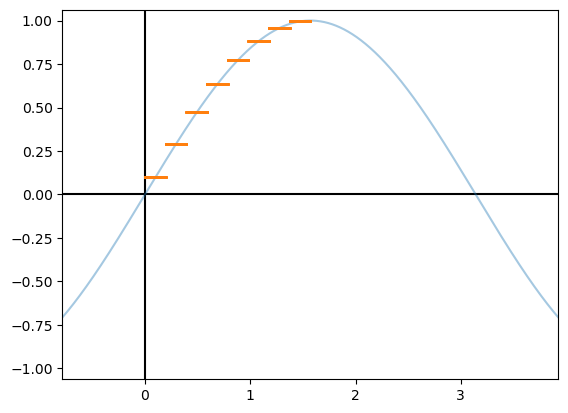
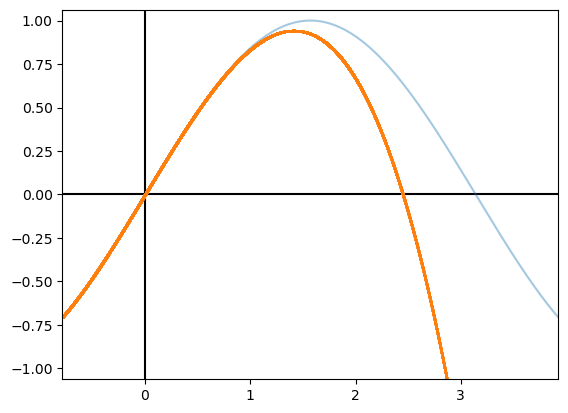
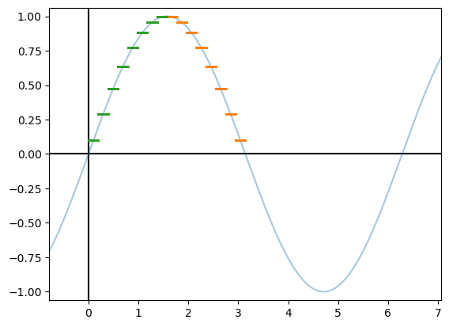
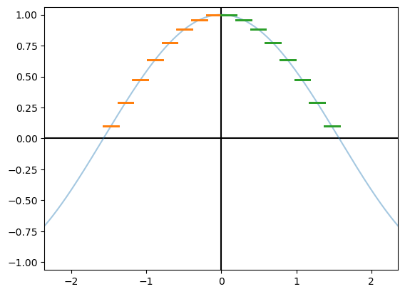
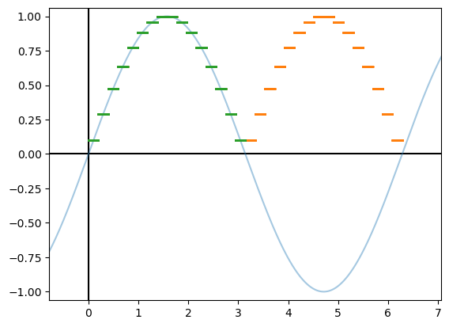
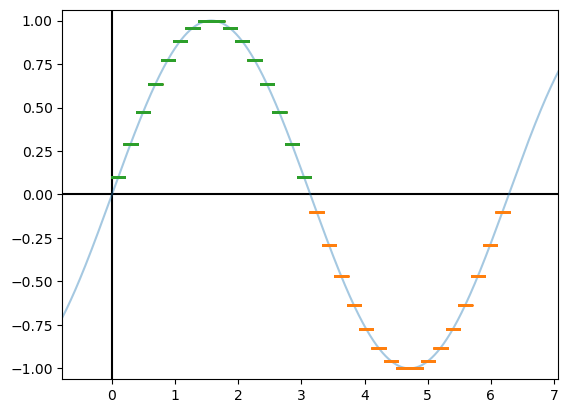
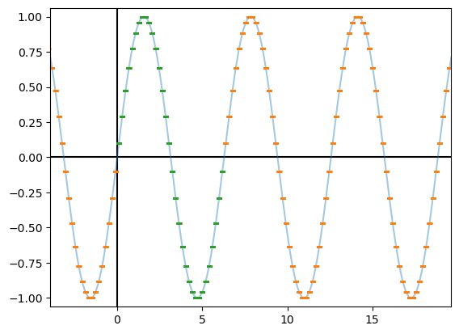
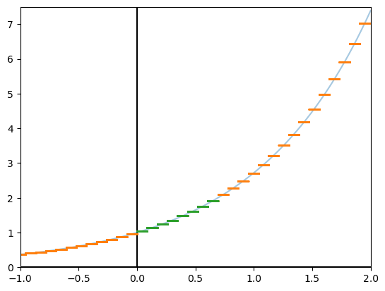

# How Math Functions are Made

With floating point we get aceess to (usually) addition, subtraction, division, and multiplication.
Then how are `libm` functions implemented?
These functions include $\sin$, $\cos$, $\exp$, and all sorts of other functions.


## Approximations On a Small Interval

Given the task of approximating one of these functions on a small interval we can look to a couple different solution.


### Lookup Tables

A simple solution would be to divide up the interval and then make a table that has a "correct" value for each subdivision.

 low    | high   | sin((high+low)/2)
--------|--------|-------------------
 0.0    | 0.1963 | 0.0980
 0.1963 | 0.3926 | 0.2902
 0.3926 | 0.5890 | 0.4713
 0.5890 | 0.7853 | 0.6343
 0.7853 | 0.9817 | 0.7730
 0.9817 | 1.1780 | 0.8819
 1.1780 | 1.3744 | 0.9569
 1.3744 | 1.5707 | 0.9951

Then, if a value is in the table's domain, you can just lookup which element you want.
The above table splits $[0, \pi/2]$ into 8 regions, so each region is $\pi/16$ wide.
This means we can get the row by dividing the input by $\pi/16$ and flooring the result.
This corresponds to a rather rough approximation of $\sin$ seen below.

```
def table_sin(x):
    if 0 <= x < math.pi/2:
        idx = math.floor(x / (math.pi/16))
        return sin_table[idx]
```




### Polynomials

There is a long history of approximating a function by a representative polynomial.
Taylor Polynomials are the most famous, but there are also chebyshev polynomials, and <>.
These produce an expression with infinite terms, so to keep the value computable we truncate the polynomial.
If we take the Taylor Polynomial for $\sin$ and truncate it to $2$ terms we get $x - \frac{x^3}{3!}$, which we then approximate using the code `x + x*x*x/6`.
This yields the following graph.

```
def poly_sin(x):
    return x - x*x*x/6
```



Similar to table based approximation the polynomial one only works for a small domain.


### Improvements

There are many ways to improve these approximations.
At the bare minimum increasing the table size or the number of terms in the polynomial will increase accuracy.
A larger table comes at speed and memory usage penalties.
Using more terms in the polynomial also increases runtime, but has an additional issue that each additional term is closer to zero and will eventually underflow to zero.

For tables you can increase accuracy while not increasing memory footprint by using interpolation schemes to smooth out the step function.
It is also possible to combine the two approaches to make a piecewise polynomial.
Basically, this means the table has a set of coefficients for a polynomial in that range instead of just a single output value.

Polynomials can also be improved.
How a polynomial is actually implemented can change both the accuracy and speed of that polynomial.
If you look at the expression `1 - x*x/2 + x*x*x*x/24 + x*x*x*x*x*x/720` it is easy to see that each succesive term using `x` contains the previous (`x*x` is in `x*x*x*x`).
Evalutaion using the Horner method simply re-parenthises the expression and performs some factoring to yield `1 - x*x(1/2 + x*x(1/24 + x*x(1/720)))`.
In this version the only repeated computation is `x*x`, which can be computed once as `x2 = x*x` then used in the polynomial form.
This version is both more accurate and faster to evaluate than the first version of the expression, especially when the FMA operation is available.
There are other ways of implementing polynomials that utilize compensation terms to achieve higher accuracy, or use high precision tricks to implement part of the polynomial.
Estrin's Scheme is yet another way ov evaluating a polynomial, this time optimized for parallel evaluation.

There are also a number of ways to generate a polynomial.
For a single polynomial the best method is the Remez algorithm which produces real valued coeeficients, and the lll algorithm produces the best floating point versions of those coefficients.
Both of these are implemented in the Sollya tool.
The stability of these algorithms is a bit precarius as the difference between an error or a result being produced is a matter of small changes to the configuration.

Instead of just looking at a single polynomial Pade aproximations use a fraction of polynomials.
These work better when the function being approximated can reach infinity.
I am unaware of software that produces Pade approximations.

There is recent, amazing, work in the RLibm project.
All other methods stem from using real values approximations of a function, then somehow translating the real valued approximation to floating point.
Since the approximation is representing a real valued function that is then rounded to floating point there is no bound for how accurate the approximation needs to be to round correctly.
If the real function passes very close to a midpoint between two floating point values then, to get a correctly rounded implementation, the error of the approximation plus the error of the floating point used must be below the difference between the midpoint and the real value of the function.
With RLibm they treat the function being approximated as the correctly rounded output in floating point.
They encode these points in a constraint solver, which means the polynomial being produced needs to only approximate the target with an error less than half a ULP (unit in the las place).
There are additional tricks they use to make this scale to 32 bits, but the basic idea is that they aren't approximating a real valued function, they are approximating the correctly rounded floating point output.


### Limitations

Any method for approximating a function has nontrivail tradeofs of domain, speed, accuracy, portability, and memory usage.

For any approximation method the error increases dramatically with the size of the domain.
As such we want to use as small of a domain for approximations.
To achieve this so called "range reductions" and "reconstructions" are used.


## Range Reductions and Reconstructions

Despite the name, range reductions take values in a larger domain and map them to a smaller domain, then after modifying the output of the inner aproximation to produce the next output.


### Mirror to the Right

Looking back at our $\sin$ approximations we can see that the approximated region, $[0, \pi/2]$, is a mirror reflextion of the region $[\pi/2, pi]$.

```
def mr_table_sin(x):
    new_x = x if (x < math.pi/2) else math.pi - x
    return table_sin(new_x)
```



We can perform this mirroring by passing through values less than $\pi/2$, and for the rest subtracting the value from $\pi$.
You can also think of this as plotting the function with a wet ink on paper and folding along $x=\pi/2$.

For this type of reduction to be valid for a function $f$ at the inflextion point $p$, we need the following identity to be true: $f(x) = f(2\cdot p - x$.
I think this might not need to be true for all $x$, but just a local region near $p$ depending on the other reductions used.


### Mirror to the Left

A similar reduction can be made that mirrors the approximation from the right of the inflextion point to the left.
Usage of this can be seen if you have an approximation of $\cos$ on $[0, \pi/2]$ and mirror it to be valid on $[-\pi/2, pi/2]$

```
def table_cos(x):
    if 0 <= x < math.pi/2:
        idx = math.floor(x / (math.pi/16))
        return cos_table[idx]

def ml_table_cos(x):
    new_x = 0.0 - x if (x < 0.0) else x
    return table_cos(new_x)
```



The mapping this time is to pass $x$ through if it is more than the inflextion point, and subtract $x$ from the inflection point when $x$ otherwise.
For $f$ and $p$ this is only valid if $f(x) = f(p - x)$.


### Combined Mirror and Negate

For both $\sin$ and $\cos$ mirroring alone won't be able to continue out the approximation further.
Looking at our $\sin$ we could first mirror to thr right at $\pi$ to get this McDonald's M plot.

```
def mr_mr_table_sin(x):
    new_x = x if (x < pi) else 2*pi - x
    return mr_table_sin(new_x)
```



We have the correct shape, it is just poking the wrong way.
To fix this we can reconstruct our output value by negating it if the input was above the inflection point.
Doing both the mirroring and negating we first reduce the input, then after the call to the inner approximation we change the resulting output.

```
def cmnr_mr_table_sin(x):
    new_x = x if (x < math.pi) else 2*math.pi - x
    y = mr_table_sin(new_x)
    new_y = y if (x < math.pi) else -y
    return new_y
```



Similar to the mirror transform the combined mirror and negate can both be to the right, as it is here, or left.

The required identity on $f$ for point $p$ is that $f(x) = - f(2*p - x)$ for the right version and $f(x) = -f(p - x)$ for the left version.

### Additive Reduction

At this point we have to tools to take a function approximation and expand it quite a bit.
We could even repeatedly apply these transforms to get an arbitrary domain.
Looking at the $\sin$ function we can see that it just repeats infinitely, so we can take any value on $[0, \infty]$ and reduce it to $[0,2\cdot\pi]$.
Essentially what we want is to chop our $x$ up into $2\cdot\pi$ pieces, throw those away, and keep the last piece to know how far into the last repeat was left over.
Essentially we are performing $q=\lfloor x/(2\cdot\pi) \rfloor, x'=x-q\cdot2\cdot\pi$.
This can be done many ways, from a direct translation like `q=floor(x/(2*pi))`, `new_x=x-q*2*pi`, to variations using high precision constants and operations.
All together this is called an _additive reduction_ and it applies to periodic functions.
To put this in the same terms as the other reductions, given a function $f$, a period width of $w$, we need the following to be universally true $f(x) = f(x+w)$

```
def ar_cmnr_mr_table_sin(x):
    k = floor(x/(2*pi))
    new_x = x - k*2*pi
    return cmnr_mr_table_sin(new_x)
```




## <Exp Reductions>

When reducing the $\exp$ function the reduction stage is the same as with __additive reduction__, but adds an additional reconstruction step.
This is similar to how the __Combined Mirror and Negate__ is a __Mirror__ with an added reconstruction.
When reducing the input we use a period of $\ln(2)$.
Annoyingly the function `log` can either mean natural log, or log base ten, depending on the language/system.
On reconstruction the answer is multiplied by $2^k$.

```
def exp_reduce_table_exp(x):
    k = floor(x / log(2))
    new_x = x - k*log(2)
    y = table_exp(new_x)
    new_y = y * 2.0**k
    return new_y
```



This reconstruction step can be performed by some bit manipulation on the floating point representation.
Binary floating point numbers are essentially, in the normal region, $sign \cdot mantissa \cdot 2^{exponent}$.
We can shortcut multiplication of the value $2^k$ by adding $k$ to the $exponent$.

To apply this type of reduction you need a very specific identity for the function $f$ and period $p$.
It must be that $f(x) = f(x-p)\cdot 2$.

Another way of performing this reduction an reconstruction opens an interesting view of the function.
With the shown reduction the value of `new_x` is on the range $[0, \ln(2)]$.
An alternate way of calculating `k` and `new_x`, is `k = ceil(x/log(2) - log(2)/2)` and `new_x = x - k * log(2)`.
This causes `k` to be offset from the first way it was calulated, and in turn `new_x` is now in the range $[\ln^2(2)/2-\ln(2), \ln^2(2)/2] ~ [-0.4529, 0.2402]$.
Mathematically both pairs of reduction and reconstruction are equal, but the inner approximation will be over a different region.
This useful for approximations that increase arror as the value get further from zero, such as the Maclaurin series approximation of a function.

### 
